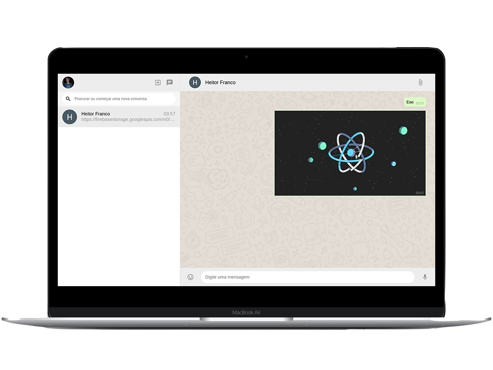

<h1 align="center" style="height: 50px; color: #7AD06D">
  
  Whatsapp Clone
</h1>

<p align="center">

</p>

## 🛠 Tecnologias

Esse projeto foi desenvolvido com as seguintes tecnologias:

- [HTML](https://html.com/)
- [CSS](https://developer.mozilla.org/pt-BR/docs/Web/CSS)
- [JavaScript](https://www.javascript.com/)
- [ReactJs](https://reactjs.org)
- [Firebase](https://firebase.google.com/)

## 💻 Projeto

Esse Projeto é um clone do [Whatsapp](https://web.whatsapp.com/), que foi desenvolvido com o intuito de colocar em prática as tecnologias que venho aprendendo.

## 🛠️ Funcionalidades

- Enviar mensagens
- Enviar imagens
- Enviar emoticon

## 🚀 Como executar

## Clone o Repositório

```
$ git clone https://github.com/HeitorFranco/whatsapp_clone.git

$ cd whatsapp_clone
```

## Instalando Dependências

```
$ yarn
```

_or_

```
$ npm install
```

## Executando Aplicação

```
$ yarn start
```

_or_

```
$ npm start
```

Agora você pode acessar [`localhost:3000`](http://localhost:3000) do seu navegador.

---

Feito com ❤️ by Heitor Franco
